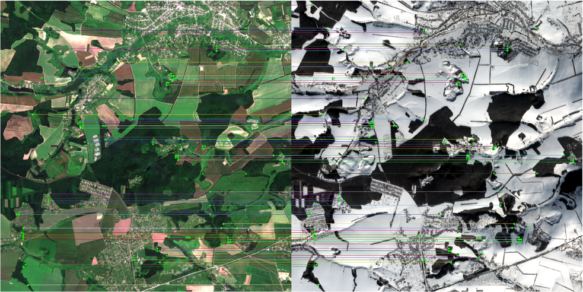

# Sentinel Image Matching

## Project overview

This project implements an automatic image matching pipeline for Sentinel-2 Level-1C satellite imagery using the pretrained **LoFTR (Detector-Free Local Feature Matching)** model.

The pipeline automatically:

- loads Sentinel-2 `.SAFE` scenes;
- constructs RGB images from spectral bands;
- splits large satellite images into fixed-size tiles;
- filters invalid tiles containing large NoData regions;
- matches corresponding tiles using the pretrained LoFTR model;
- selects the best matching tile pair;
- visualizes feature correspondences.

The implementation is fully automatic and can be applied to any Sentinel-2 Level-1C scenes stored in the standard `.SAFE` format.

# Project goal

The goal of this project is to automatically identify corresponding regions between two Sentinel-2 satellite images acquired on different dates using a modern detector-free feature matching approach.

Instead of training a model from scratch, the project uses the pretrained **LoFTR** model, which is specifically designed for robust local feature matching.

# Pipeline

The complete workflow consists of the following stages:

1. Locate the Sentinel-2 `IMG_DATA` directory.
2. Read RGB spectral bands:
   - B04 — Red
   - B03 — Green
   - B02 — Blue
3. Construct a natural-color RGB image.
4. Split each image into **1024 × 1024** pixel tiles.
5. Remove tiles containing large NoData regions.
6. Match corresponding tiles using the pretrained LoFTR model.
7. Rank candidate tile pairs according to:
   - number of feature matches;
   - average matching confidence.
8. Select the best matching tile pair.
9. Visualize the detected correspondences.

## Project structure
```bash
task2/
│── assets/                # image matching result
├── data/                  # Sentinel-2 .SAFE scenes (not included)
├── weights/               # Pretrained LoFTR weights (not included)
│
├── notebooks/
│   ├── dataset_creation.ipynb     # Dataset preparation workflow
│   └── demo.ipynb                 # Pipeline demonstration
│
├── src/
│   ├── io.py                      # Reading Sentinel-2 imagery
│   ├── tiling.py                  # Image tiling and filtering
│   ├── matcher.py                 # LoFTR inference and tile ranking
│   ├── pipeline.py                # Complete matching pipeline
│   └── visualization.py           # Visualization utilities
│
├── inference.py                   # Run the complete pipeline
├── requirements.txt               # Project dependencies
└── README.md
```

# Dataset

The project uses Sentinel-2 Level-1C imagery from the public Kaggle dataset:

https://www.kaggle.com/datasets/isaienkov/deforestation-in-ukraine

The assignment allows using either the official Sentinel-2 source or the provided Kaggle dataset.

The full dataset is approximately **36 GB**. For this project, only two Sentinel-2 `.SAFE` scenes are required.

The demonstration uses two Sentinel-2 scenes covering the same geographic tile (`T36UYA`) acquired in different seasons:

- `S2A_MSIL1C_20160621T084012_N0204_R064_T36UYA_20160621T084513.SAFE` Summer (June 2016)
- `S2A_MSIL1C_20160212T084052_N0201_R064_T36UYA_20160212T084510.SAFE` Winter (February2016)

The `.SAFE` scenes are not included in this repository due to their size.

## Download dataset or scenes

These two scenes can be downloaded separately from the Kaggle dataset
```bash
https://www.kaggle.com/datasets/isaienkov/deforestation-in-ukraine?select=S2A_MSIL1C_20160621T084012_N0204_R064_T36UYA_20160621T084513
```
```bash
https://www.kaggle.com/datasets/isaienkov/deforestation-in-ukraine?select=S2A_MSIL1C_20160212T084052_N0201_R064_T36UYA_20160212T084510
```

After downloading, place the `.SAFE` folders inside:

```bash
data/
```

## Download Model weights

This project uses the pretrained **LoFTR Outdoor** model.

Weights are not included in the repository.

Download the pretrained weights:

```bash
https://drive.google.com/file/d/1IZag9Q3WLyBI_1RX0QlCC07xINbAIlRp/view?usp=sharing
```
Place the file here:

```text
weights/
└── loftr_outdoor.ckpt
```

# Jupyter notebooks

## dataset_creation.ipynb

Explains the complete dataset preparation process.

Includes:

- Sentinel-2 dataset overview;
- RGB band construction;
- image tiling;
- valid tile filtering;
- tile statistics;
- brightness distribution.

## demo.ipynb

Demonstrates the complete image matching pipeline.

Includes:

- loading Sentinel-2 scenes;
- running the matching pipeline;
- selecting the best tile;
- visualizing LoFTR correspondences;
- reporting matching statistics.

# Results

The pipeline successfully matches satellite images acquired during different seasons.

The figure below shows the best matching tile pair together with the feature correspondences detected by the pretrained LoFTR model.



Example result:

- Best tile selected automatically.
- More than **9000** feature correspondences.
- Mean confidence approximately **0.69**.

The approach demonstrates robust matching despite significant seasonal appearance changes.

# Installation

1. **Clone the repository:**
```bash
git clone https://github.com/Pasha0923/Quantum-test-task.git
cd task2
```
2. **Create virtual environment (recommended)**
```bash
python -m venv venv
venv\Scripts\activate
```
3. **Install dependencies:**
```bash
pip install -r requirements.txt
```
4. **Additional setup**

Before running the project, make sure you have:

- downloaded the pretrained **LoFTR Outdoor** weights and placed `loftr_outdoor.ckpt` into the `weights/` directory;
- downloaded the two required Sentinel-2 `.SAFE` scenes and placed them into the `data/` directory.

5. **Run inference**

```bash
python inference.py
```
The script automatically:

- loads Sentinel-2 scenes;
- loads pretrained LoFTR weights;
- finds the best matching tiles;
- visualizes feature correspondences.

# Technologies

- python
- torch
- torchvision
- kornia
- rasterio
- numpy
- opencv-python
- matplotlib
- pandas
- jupyter notebook

# Task deliverables

This repository contains all required deliverables from the assignment:

-  Dataset preparation and preprocessing notebook (`dataset_creation.ipynb`)
-  Demo notebook (`demo.ipynb`)
-  Python implementation of the matching algorithm (`src/`)
-  Python inference script (`inference.py`)
-  Dataset download instructions
-  Pretrained model weights download instructions